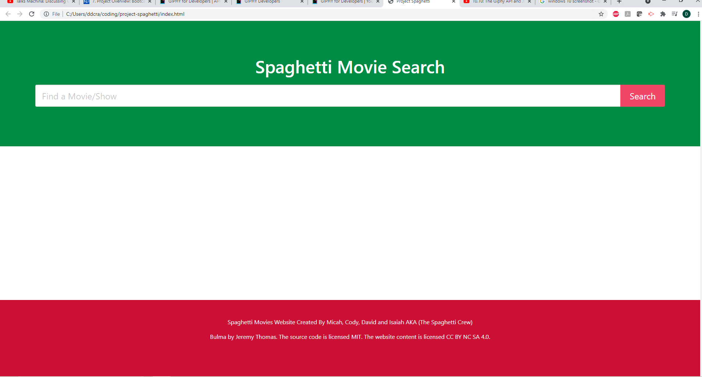

# project-spaghetti

Project Spaghetti is the latest movie search website, implementing OMDb and Giphy API's to bring you all the movie info you could ask for which includes the title, description and a fun giph of the searched movie!

## Our Team:
###
Isaiah Negron (Backend - JS and Functionality)
David Crane (Backend - JS and Functionality)
Micah Duehring (Frontend - HTML / Bulma CSS Framework)
Cody McCray (Frontend - HTML / Bulma CSS Framework)

## Our User Story:
###
AS A Movie Enthusiast

I WANT to see a movie or television shows details about the movie

SO THAT I can accurately choose a movie or show of my preference

GIVEN I love movies and/or television shows

WHEN I search a movie or show of my choice

THEN I am given the movie or T.V shows, Title, description, and a fun giph for entertainment!

---
## Base Model Original Plan A Wireframe Example

https://www.icloud.com/iclouddrive/0-Fdj4RqXcSoWFHGbnNVqKpHw#PROJECT1WIREFRAME_copy

---

## API's Used
1. OMBD
2. GIPHY

--- 

## Project Issues
1. Create wireframe/Sketch
2. Build UI with Bulma
3. Make app mobile friendly
4. Integrate API's
5. Integrate Search Bar

https://isaiahnegron.github.io/project-spaghetti/

